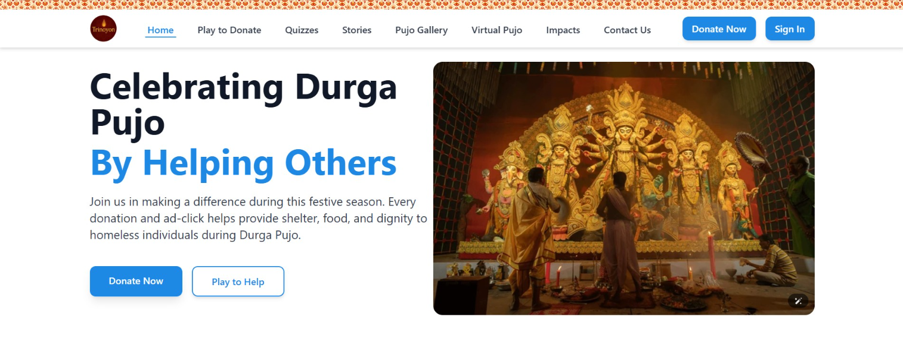

# 🕉️🔱 Project-Trinoyon — Contribute Code to the Society

Welcome to **Project-Trinoyon** — a heartfelt initiative to make Durga Puja a celebration for everyone! This project is dedicated to bringing smiles to the faces of underprivileged individuals, especially those living on the streets, during this vibrant festival.

We combine the power of 💸 donations, 🎮 gamified ad revenue, 🤖 machine learning engagement, and 🫂 community interaction to make a real social impact — all through one immersive and meaningful digital experience.

## ❓ Problem Statement

Durga Puja is more than just a festival — it’s a celebration of love, power, and shared joy. While many revel in lights, music, food, and celebration, countless others struggle to survive on the streets, often invisible and forgotten during these festive days.

## 🎯 Our Solution

Project-Trinoyon strives to bring inclusivity to the celebration by using a technology-powered platform that allows people to:

- Donate money directly to verified local outreach initiatives 💸
- Play games that generate ad revenue — just by spending time having fun 🎮
- Connect with others through stories, celebrations, and shared cultural experiences 📸📝
- Participate in fun ML-based activities to boost site engagement 🤖
- Share positivity and build a compassionate digital community 🙌

## 🌟 Key Features

### 💖 Donate with Love
- Secure donation gateway integration (Google Pay, UPI, and Netbanking)
- Transparent tracking of total contributions and goals
- Progress bars and donation milestones

### 🎮 Play for a Cause
- A selection of browser-based casual games
- Google AdSense integration for revenue generation
- Every second played = revenue earned for social good

### 🖼️ Pujo Gallery — A Celebration Wall
- Users can upload photos, videos, or text posts from their Durga Puja celebration
- View, like, comment, and share posts — like a festive Instagram/Quora experience
- Hashtag system to explore community moments (#Puja2025, #DurgaVibes)

### 🤖 ML-Powered Engagement Activities
- Personality prediction based on Puja preferences (e.g., “Which goddess represents you?”)
- Mood prediction from uploaded selfies
- Community-driven prediction polls (“Which idol will win this year’s best pandal?”)

### 💬 Community Interaction
- Idea board for new social features
- Share stories of giving back, volunteering, and joy
- Live Puja chatroom / event ticker

### 📊 Impact Dashboard
- Live tracking of donation statistics and community impact
- Real-time updates on meals distributed, clothes donated, and families helped
- Showcase of present contributors and recent donations
- Transparent progress bars showing goals and achievements
- Community testimonials highlighting the impact of contributions

### 🔐 Trust & Safety
- Report & moderation tools
- Verification badges for organizers
- Public transparency log of donations and impact

## 🎯 Purpose

- Raise funds through donations and gamified ad interactions
- Provide essentials (food, clothing, shelter) to underprivileged individuals during Puja
- Build a digital cultural experience that promotes empathy and togetherness
- Spread awareness and inspire young people to contribute creatively and socially

## 🛠️ Tech Stack

- Frontend: HTML5, CSS3, JavaScript, React  
- Backend: Node.js, Express.js  
- Game Frameworks: Vanilla JS, Three.js  
- ML: TensorFlow.js or Flask-based API  
- Payments: Google Pay / UPI Integration  
- Ad Monetization: Google AdSense  
- Storage: Firebase or MongoDB  
- Deployment: TBD

## 🚀 How It Works

1. Visit the Project-Trinoyon website 🌐  
2. Choose to Donate 💰, Play 🎮, or Explore 📸  
3. Share and invite others to participate  
4. Collected funds are transparently routed to verified organizations  
5. Track real-time impact through our Impact Dashboard 📊
6. See how your contributions are making a difference with live statistics
7. Impact reports and photo stories will be shared post-festival  

## 🤝 How to Contribute

- 💡 Suggest new features or improvements  
- 🧠 Submit ML engagement ideas or help build them  
- 🧑‍💻 Fork the repo and contribute via Pull Requests  
- 📝 Report bugs, UI suggestions, or accessibility enhancements  

Every voice, every contribution matters.

- **Present Contributors(In alphabetical order)**: Arijit Sarkar, Koushik Ghosh, Rakesh Adak, Upolobdhi Karmakar, Yuvraj Singh
## 📬 Suggestions & Collaboration

We value your creativity and feedback!  
Got an idea or want to collaborate with us?  
Let’s co-create this movement together.  
Feel free to open an issue, submit a PR, or reach out to our team at `codesnippets45@gmail.com`.

## 🌟 Special Thanks

To every donor, developer, volunteer, and visitor — your small act is part of something larger.  
Let’s celebrate Durga Puja not just with lights and colors — but with purpose and kindness.  
Together, let’s illuminate lives. 🪔✨

## 📜 License

This project is licensed under the Apache-2.0 License.
